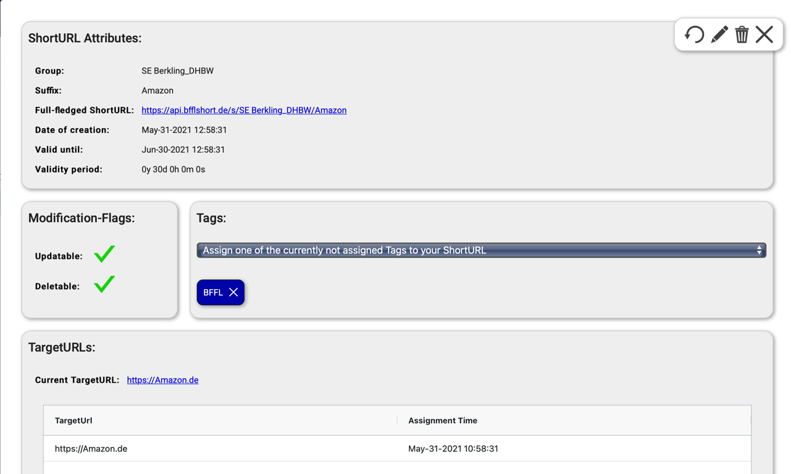
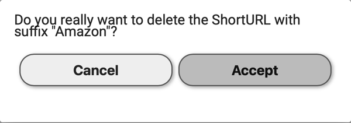
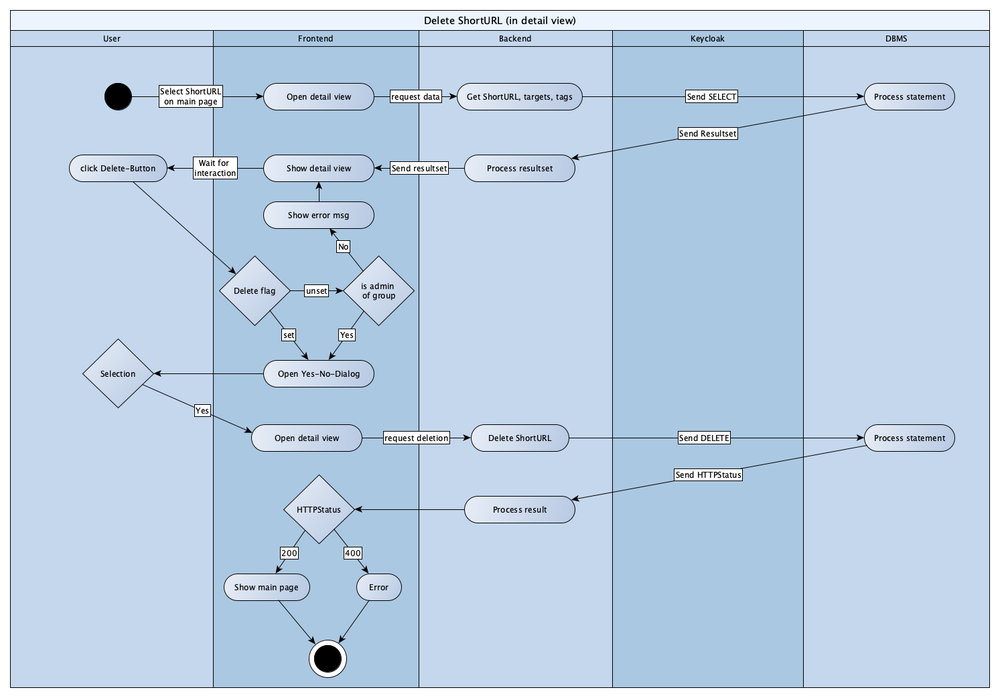

# BFFL
# Use Case Specification: Delete an URL-entry.

## Version <1.0>

# Revision History
-----

|    Date    | Version | Description | Author |
|------------|---------|-------------|--------|
| 15.06.2021 |   1.0   |  -  | Krayaty |

# Table of Contents

- [1. Use-Case Name](#1-Use-Case-Name)
  * [1.1 Brief Description](#11-Brief-Description)
- [2. Mock Up](#2-Mock-Up)
  * [2.1 Mock](#21-Mock)
  * [2.2 Screenshots](#22-Screenshots)
- [3. Flow of Events](#3-Flow-of-Events)
  * [3.1 Basic Flow](#31-Basic-Flow)
  * [3.2 Alternative Flows](#32-Alternative-Flows)
- [4. Special Requirements](#4-special-requirements)
- [5. Preconditions](#5-Preconditions)
- [6. Postconditions](#6-Postconditions)

# Use Case Specification: Delete an URL-entry.

## 1. Use-Case Name  
### 1.1 Brief Description
The content of this document is the specification of the use case called "Delete URL-entry".
The use case itself is part of a CRUD regarding the management of URLs in our application. The CRUD holds all four operations (Create, Read, Update, Delete) which you will find [here](CRUD.md).


## 2. Mock Up
### 2.1 Mock


### 2.2 Screenshots
### 2.2.1 Yes-No-Dialog


## 3. Flow of Events
### 3.1 Basic Flow


### 3.2 .feature
``` Cucumber
  Feature: Use Case to delete an URL-entry
    As a user
    I want to open the app and be able to remove a shortened URL from my group under specific circumstances.

    Background:
      Given The user is logged in
      And The user is part of a group
      And The group has at least one URL-entry

    Scenario: Error - Delete flag not set and user isn't admin of group
      Given The delete flag of the url is set
      And The user is not admin of chosen group
      Then The delete button shouldn't be shown

    Scenario: Success - Delete flag is set or user is admin of group
      Given The delete flag of the url is set
      Or the user is admin of the chosen group
      When The user clicks the button "Delete"
      Then A yes-no-dialog should be shown
      When Yes
      Then Delete the URL-entry
```

### 3.2 Alternative Flows
n/a


## 4. specific requirements
n/a

## 5. Preconditions
To delete an URL-entry following requirements have to be met:
- The user must be logged in with a valid account.
- The account of such user has to be part of at least one group.
- The group must have at least one URL-entry.

## 6. Postconditions
After an URL-entry has been deleted succesfully, the client will be redirected to the main page.
In case of an error the client remains in detail view.
