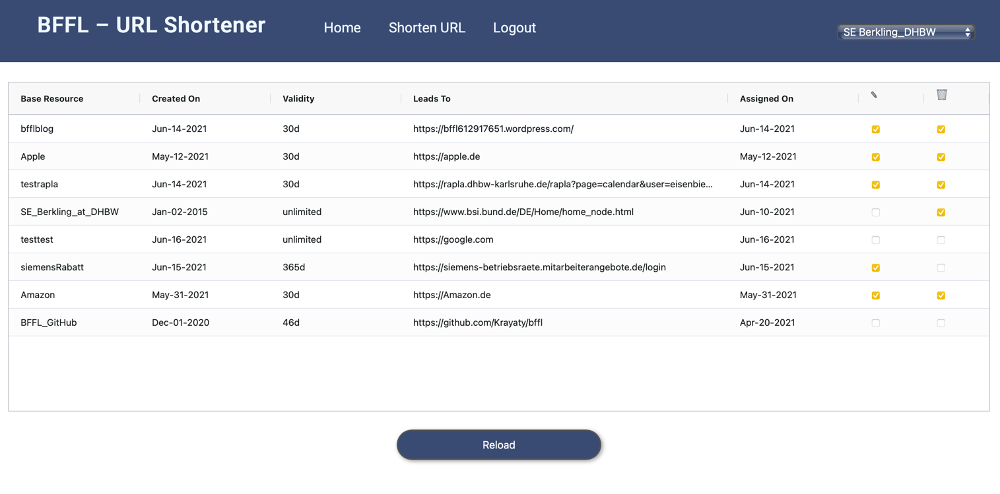
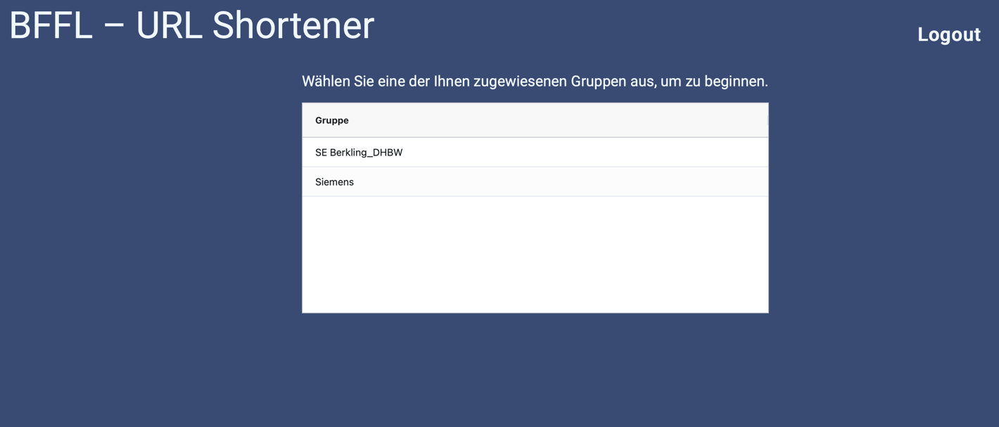
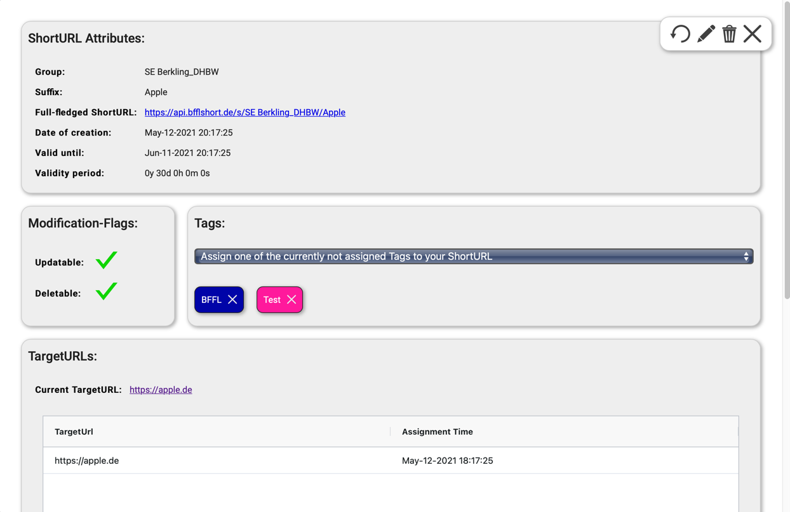
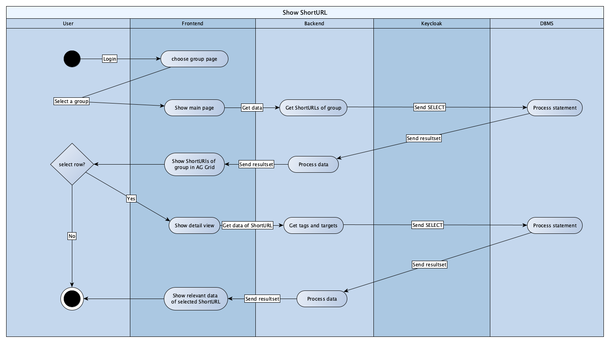

# BFFL
# Use Case Specification: Show URL-entries.

## Version <1.0>

# Revision History
-----

|    Date    | Version | Description | Author |
|------------|---------|-------------|--------|
| 16.06.2021 |   1.0   |  -  | Krayaty |

# Table of Contents

- [1. Use-Case Name](#1-Use-Case-Name)
  * [1.1 Brief Description](#11-Brief-Description)
- [2. Mock Up](#2-Mock-Up)
  * [2.1 Mock](#21-Mock)
  * [2.2 Screenshots](#22-Screenshots)
- [3. Flow of Events](#3-Flow-of-Events)
  * [3.1 Basic Flow](#31-Basic-Flow)
  * [3.2 Alternative Flows](#32-Alternative-Flows)
- [4. Special Requirements](#4-special-requirements)
- [5. Preconditions](#5-Preconditions)
- [6. Postconditions](#6-Postconditions)

# Use Case Specification: Show URL-entries.

## 1. Use-Case Name  
### 1.1 Brief Description
The content of this document is the specification of the use case called "Show URL-entries".
The use case itself is part of a CRUD regarding the management of URLs in our application. The CRUD holds all four operations (Create, Read, Update, Delete) which you will find [here](CRUD.md).


## 2. Mock Up
### 2.1 Mock


### 2.2 Screenshots
### 2.2.1 Detailview


### 2.2.2 Detailview


## 3. Flow of Events
### 3.1 Basic Flow


### 3.2 .feature
``` Cucumber
  Feature: Use case to be able to see all necessary information about the ShortURLs of selected group
    As a user
    I would like to be able to see all the important information about the ShortURLs of my groups.

    Background:
      Given The user is logged in
      And The user is part of a group

    Scenario: Success - No ShortURLs exist
      Given The selected group hasn't created a ShortURL yet
      Then The AG Grid on the main page stays empty
      And The user has no further options to interact

    Scenario: Success - At least one ShortURL exists
      Given The selected group has created at least one ShortURL yet
      Then The AG Grid on the main page shows the core infos on the ShortURL in a compact way
      When The user clicks on a row (ShortURL) in the AG Grid
      Then The detail view of this ShortURL is shown with more concrete and further information
```

### 3.2 Alternative Flows
n/a

## 4. specific requirements
n/a

## 5. Preconditions
To show URL-entries following requirements have to be met:
- The user must be logged in with a valid account.
- The account of such user has to be part of at least one group.
- The group must have at least one URL-entry unless you want to see an empty Grid ;).

## 6. Postconditions
This is kind of the main part of the App and therefore the starting and endpoint of most of the interactions.
If you leave the detailview you will see the main AG Grid again.
