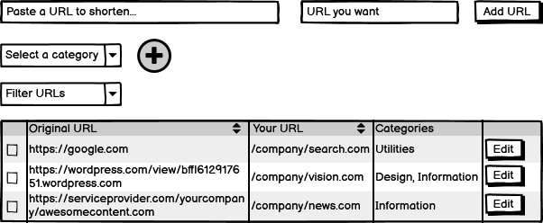
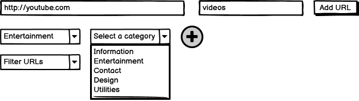
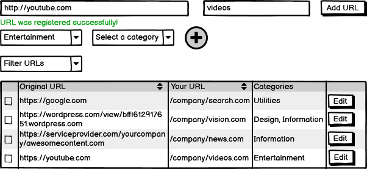
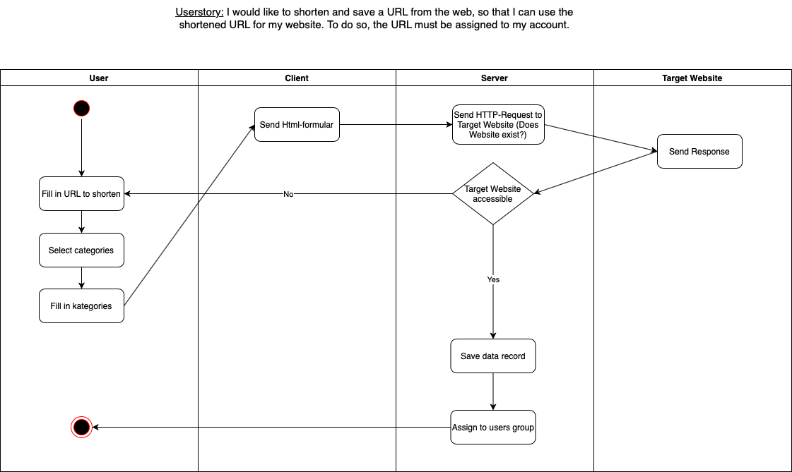

# BFFL
# Use Case Specification: Create a new URL-entry.

## Version <1.0>

Revision History
----

|    Date    | Version | Description | Author |
|------------|---------|-------------|--------|
| 23.10.2020 |   1.0   |  First specification of use case   | Felix |

# Table of Contents

- [1. Use-Case Name](#1-Use-Case-Name)
  * [1.1 Brief Description](#11-Brief-Description)
- [2. Mock Up](#2-Mock-Up)
  * [2.1 Mock](#21-Mock)
  * [2.2 Screenshots](#22-Screenshots)
- [3. Flow of Events](#3-Flow-of-Events)
  * [3.1 Basic Flow](#31-Basic-Flow)
  * [3.2 Alternative Flows](#32-Alternative-Flows)
- [4. Special Requirements](#4-special-requirements)
- [5. Preconditions](#5-Preconditions)
- [6. Postconditions](#6-Postconditions)
  
# Use Case Specification: Update an URL-entry.
  
## 1. Use-Case Name  
### 1.1 Brief Description
The content of this document is the specification of the use case called "Create URL-entry". 
The use case itself is part of a CRUD regarding the management of URLs in our application. The CRUD holds all four operations (Create, Read, Update, Delete) which you will
find [here](CRUD.md).
 
 
## 2. Mock Up
### 2.1 Mock

  
### 2.2 Screenshots
### 2.2.1 Initial state of URL registration

### 2.2.2 After registering a new URL

 
 
## 3. Flow of Events
### 3.1 Basic Flow

  
### 3.2 Alternative Flows
n/a
  
  
## 4. Special requirements
n/a

 
## 5. Preconditions
To create a new URL-entry following requirements have to be met:
- The user must be logged in with a valid account
- The account of such user has to be part of at least one group
- The user has to be on the main page of the application
  
  
## 6. Postconditions
After a new URL has been registered succesfully, its properties must be added to the database.
In case of an unsuccessful registration the user is to be notified and the database will be left unchanged. The application remains usable.
