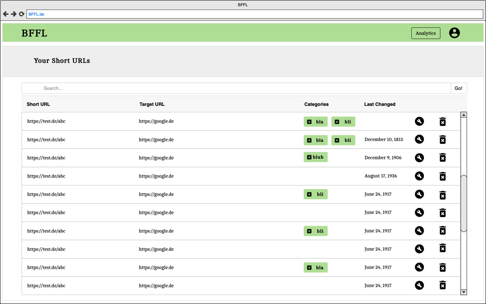
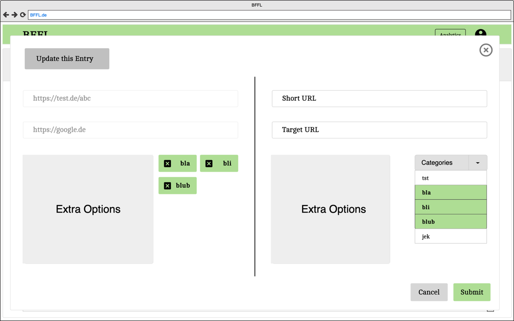
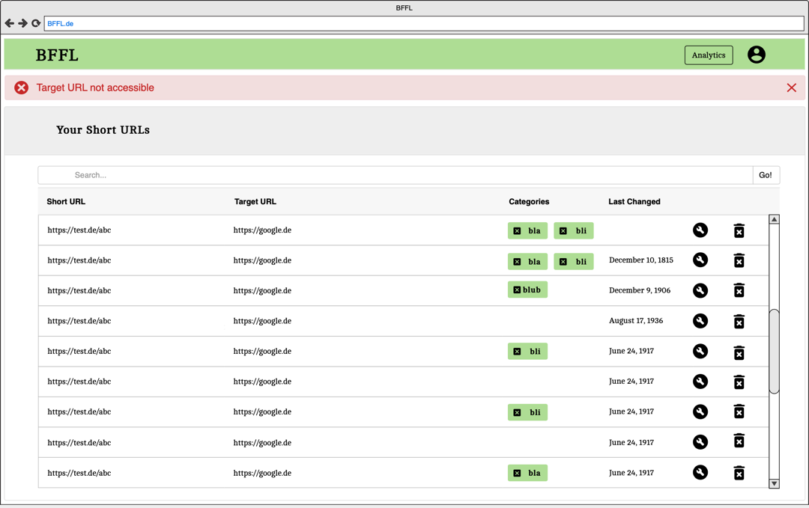
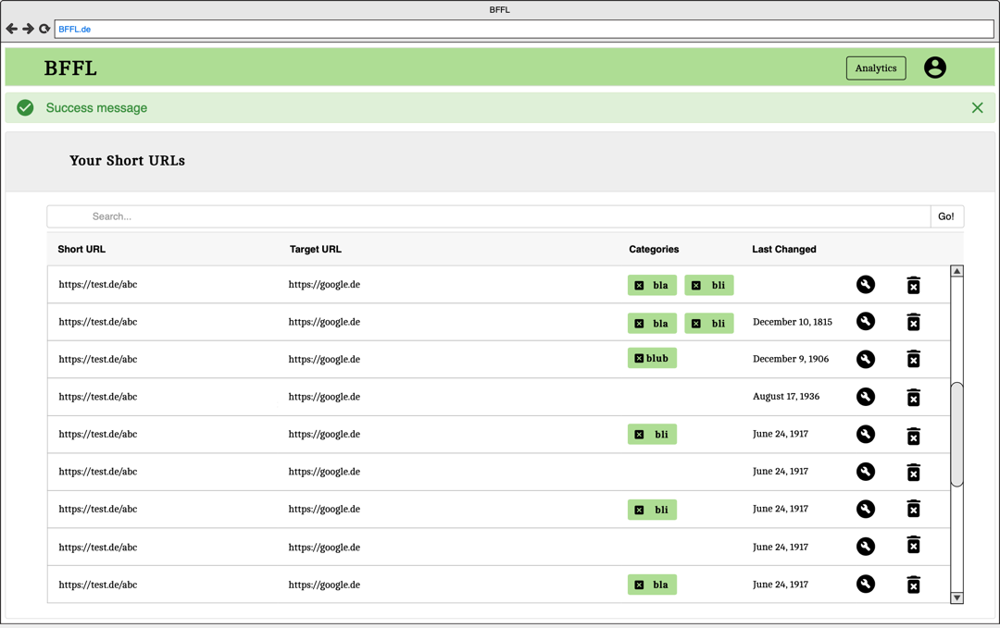
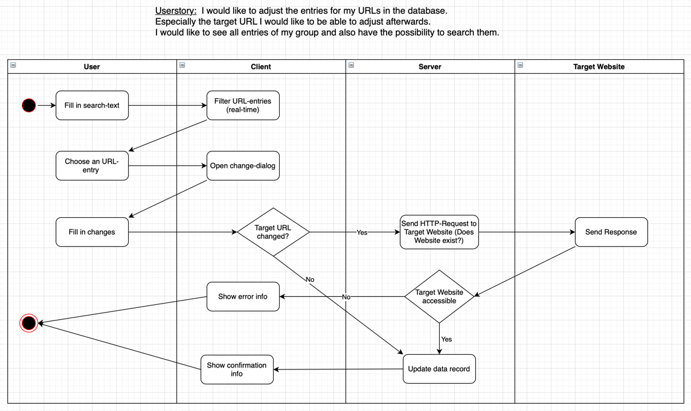

# BFFL
# Use Case Specification: Update an URL-entry.

## Version <1.0>

Revision History
----

|    Date    | Version | Description | Author |
|------------|---------|-------------|--------|
| 22.10.2020 |   1.0   |  -  | Krayaty |

# Table of Contents

- [1. Use-Case Name](#1-Use-Case-Name)
  * [1.1 Brief Description](#11-Brief-Description)
- [2. Mock Up](#2-Mock-Up)
  * [2.1 Mock](#21-Mock)
  * [2.2 Screenshots](#22-Screenshots)
- [3. Flow of Events](#3-Flow-of-Events)
  * [3.1 Basic Flow](#31-Basic-Flow)
  * [3.2 Basic Flow](#32-Basic-Flow)
  * [3.3 Alternative Flows](#33-Alternative-Flows)
- [4. Special Requirements](#4-special-requirements)
- [5. Preconditions](#5-Preconditions)
- [6. Postconditions](#6-Postconditions)
- [7. Extension Points](#7-Extension-Points)
  
# Use Case Specification: Update an URL-entry.
  
## 1. Use-Case Name  
### 1.1 Brief Description
This document is a definition of a special use case called: "Update an URL-entry".
This is part of a so-called CRUD. CRUD is an acronym that describes the four fundamental operations of data management:
- Create (Insert): Create new data.
- Read (Select, Retrieve. Search): Select existing data and make it available for further processing.
- Udate (Modify): Update existing data.
- Delete (Destroy): Delete obsolete data.

(see glossar.hs-augsburg.de (ed.): CRUD, 19th Mai 2016, https://glossar.hs-augsburg.de/CRUD, retrieved on 22.10.2020.)

The [CRUD](/CRUD.md) referred to here deals with the main content of this web application: shortened URLs.
The present document concretizes the process "Update".
 
 
## 2. Mock Up
### 2.1 Mock
The following picture shows a mock of the application in the initial state of the update process.


  
### 2.2 Screenshots
The following screenshots show the main steps of the update process in the UI shown in the [activity diagram](#31-Basic-Flow).

 


 
 
## 3. Flow of Events
### 3.1 Basic Flow

  
### 3.2 .feature-file

``` Cucumber

Feature: Update-Link
  as a User 
    I want to be able to find my shortened URLs on the main page in a List view. By clicking on an entry I want to be 
    able to change the entry. I want to see a view that shows me all changeable fields. With click on submit all changes
     should be saved. With click on cancel I the changes should be discarded.

  Background: User is logged in.

  Scenario: User and his group have no URL saved.
    Given the user and his group have no URL saved in the database
    Then an empty list should be viewed

  Scenario: The User and his group have an URL saved and successfully changes the entry.
    Given the user and his group have minimum one URL saved in the database
    When the user clicks on an entry
    Then the update-view should open for the specific entry
    When the user chages the entrys data
    And clicks on submit
    And the data is valid
    Then the data is changed in the database
    And the main page is shown
    But the update-view closes

  Scenario: The User and his group have an URL saved and changes the entry but discards the changes.
    Given the user and his group have minimum one URL saved in the database
    When the user clicks on an entry
    Then the update-view should open for the specific entry
    When the user chages the entrys data
    And clicks on cancel
    Then the changes are discarded by not sending an SQL-request
    And the main page is shown
    But the update-view closes

  Scenario: The User and his group have an URL saved and wants to change the entry, but the new data is not valid.
    Given the user and his group have minimum one URL saved in the database
    When the user clicks on an entry
    Then the update-view should open for the specific entry
    When the user chages the entrys data
    And clicks on submit
    But the data is invalid
    Then the update-view is shown again with the old data
    And an error message is shown
    But the data isn't changed in the database
```
  
### 3.3 Alternative Flows
n/a
  
  
## 4. Special requirements
n/a

 
## 5. Preconditions
The following must be done before a URL entry can be changed
- The user must be registered. 
- The user must be logged in.
- The user himself or a member of his group must have created at least one URL entry.
  
  
## 6. Postconditions
When an attempt is made to change a URL entry, the application can enter three states: 
1. The target URL is to be changed.
    1. The URL is valid and accessible.
    2. The URL is not reachable.
2. Something other than the URL is to be changed.

In the case of states 1.2 and 2, no problem occurs and success is displayed after the record has been changed.
In case of state 1.1 a problem occurs which is immediately reported to the user.
In both cases the application can be used normally.
  
  
## 7. Extension Points
This Use Case is a possible follow-up process to the [creation](/UC_Create-Link.md), [deletion](../../README.md) and [display](../../README.md) of shortened URLs in the [CRUD](/CRUD.md) described above.
