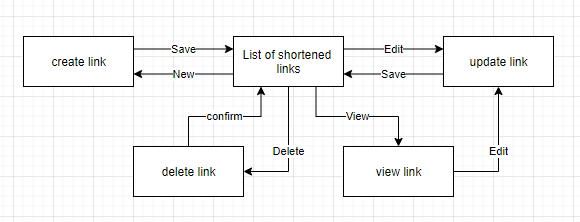

# BFFL
# Use Case Specification: Update an URL-entry.

## Version <1.0>

# Revision History
-----

|    Date    | Version | Description | Author |
|------------|---------|-------------|--------|
| 25.10.2020 |   1.0   |  -  | Lars |

# Table of Contents

- [1. Use-Case Name](#1-Use-Case-Name)
  * [1.1 Brief Description](#11-Brief-Description)
- [2. Mock Up](#2-Mock-Up)
  * [2.1 Mock](#21-Mock)
  * [2.2 Screenshots](#22-Screenshots)
- [3. Flow of Events](#3-Flow-of-Events)
  * [3.1 Basic Flow](#31-Basic-Flow)
  * [3.2 Alternative Flows](#32-Alternative-Flows)
- [4. Specific Requirements](#4-specific-requirements)
  * [4.1 A](#41-A)
- [5. Preconditions](#5-Preconditions)
  * [5.1 A](#51-A)
- [6. Postconditions](#6-Postconditions)
  * [6.1 A](#61-A)
- [7. Extension Points](#7-Extension-Points)
  * [7.1 A](#71-A)
  
# Use Case Specification: Update an URL-entry.
  
## 1. Use-Case Name  
### 1.1 Brief Description
The CRUD contains all ways, the user is able to interact with the shortened links.
 
 
## 2. Mock Up
### 2.1 Mock
n/a
  
### 2.2 Screenshots
n/a
 
 
## 3. Flow of Events
### 3.1 Basic Flow

  
### 3.2 Alternative Flows
n/a
  
  
## 4. specific requirements
Use Cases: 
[Create Link](UC_Create-Link.md),
[Update Link](UC_Update-Link_22Okt2020.md)
